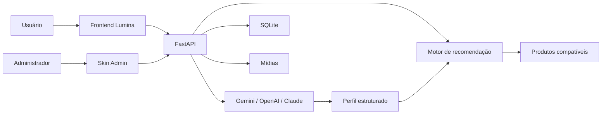

<p align="center">
  
</p>

<h1 align="center">Lumina Skin API</h1>

<p align="center">
  <strong>Análise cosmética com IA, recomendação determinística e gerenciamento completo de catálogo.</strong>
</p>

<p align="center">
  Uma aplicação full stack construída para transformar informações sobre a pele em uma experiência estruturada de análise e recomendação de produtos.
</p>

<p align="center">
  
  
  
  
  
  
</p>

<p align="center">
  <a href="#-visão-geral">Visão geral</a> •
  <a href="#-como-funciona">Como funciona</a> •
  <a href="#-funcionalidades">Funcionalidades</a> •
  <a href="#-arquitetura">Arquitetura</a> •
  <a href="#-executando-localmente">Instalação</a> •
  <a href="#-qualidade-e-validação">Validação</a>
</p>

---

## ✨ Visão geral

O **Lumina Skin** nasceu como uma API de análise cosmética e evoluiu para uma aplicação full stack composta por três partes independentes:

| Componente          | Papel                                                                   |
| ------------------- | ----------------------------------------------------------------------- |
| **API FastAPI**     | Processa análises, catálogo, recomendações, pedidos e regras de negócio |
| **Frontend Lumina** | Demonstra a experiência completa para o usuário final                   |
| **Skin Admin**      | Permite administrar catálogo, imagens, importações e pedidos            |

O núcleo do projeto é a **API**.
O frontend e o painel administrativo são clientes HTTP independentes e podem ser substituídos por outras interfaces.

> **A IA interpreta. A API decide.**
>
> Os modelos de IA ajudam a transformar fotografia ou descrição textual em informações estruturadas sobre a pele.
> A escolha dos produtos permanece sob responsabilidade de regras determinísticas e testáveis no backend.

Isso evita deixar toda a lógica de recomendação nas mãos de um modelo generativo.

---

## 🧠 Como funciona

O usuário pode iniciar a análise de três maneiras:

* 📷 enviar uma fotografia;
* ✍️ descrever características da pele;
* 🎯 informar diretamente um perfil já conhecido, sem utilizar IA.



### Fluxo de recomendação

```text
Foto / texto / perfil
        │
        ▼
Características da pele
        │
        ▼
Validação da API
        │
        ▼
Regras determinísticas
        │
        ▼
Produtos compatíveis
```

A IA **não escolhe diretamente os produtos**.

Ela atua na interpretação de informações não estruturadas. Depois disso, o backend assume o controle da decisão.

---

## 🚀 Funcionalidades

### 🔬 Análise da pele

* análise por fotografia;
* análise por descrição textual;
* perfil informado diretamente sem uso de IA;
* tratamento de informações insuficientes;
* validação de conteúdo fora do domínio;
* combinação de informações entre fotografia e texto;
* confirmação quando diferentes fontes apresentam resultados divergentes;
* proteção contra imagens inadequadas;
* processamento e sanitização das imagens antes do envio ao provedor de IA.

### 🧴 Recomendação de produtos

* recomendação baseada no perfil identificado;
* regras determinísticas e reproduzíveis;
* produtos filtrados por disponibilidade e compatibilidade;
* organização por categorias;
* justificativas de compatibilidade;
* preços e disponibilidade consultados diretamente no backend.

### 📦 Catálogo

* cadastro de produtos;
* edição;
* busca e filtros;
* ativação e desativação lógica;
* controle de estoque;
* categorias;
* tipos de pele compatíveis;
* indicação para pele sensível;
* indicação para espinhas;
* imagens de produtos;
* armazenamento e processamento automático de mídia.

### 📥 Importação em lote

O Skin Admin também oferece importação de catálogo através de:

* CSV;
* XLSX;
* texto estruturado com auxílio de IA.

Toda importação possui uma etapa de **prévia antes da confirmação**.

### 🧾 Pedidos demonstrativos

O frontend permite montar uma rotina de produtos e registrar pedidos demonstrativos.

O backend:

* recalcula preços;
* verifica disponibilidade;
* mantém histórico;
* utiliza identificadores de cliente;
* trabalha com consentimento;
* permite exclusão do histórico;
* possui política de retenção.

> O projeto não implementa pagamento real.

---

## 🖥️ Frontend Lumina

Aplicação criada para demonstrar como a API pode ser utilizada em uma experiência real voltada ao usuário.

**Tecnologias:**

* React;
* TypeScript;
* Vite;
* Tailwind CSS;
* Motion.

Entre os fluxos disponíveis estão:

* escolha do tipo de análise;
* upload de fotografia;
* análise textual;
* perfil manual;
* visualização dos resultados;
* recomendações;
* criação de rotina;
* pedidos demonstrativos;
* histórico.

---

## ⚙️ Skin Admin

Painel administrativo executado diretamente no navegador.

**Tecnologias:**

* React;
* TypeScript;
* Vite;
* Ant Design.

Permite:

* gerenciar produtos;
* pesquisar e filtrar catálogo;
* alterar estoque;
* cadastrar e substituir imagens;
* ativar e desativar produtos;
* importar produtos em lote;
* revisar prévias de importação;
* consultar pedidos demonstrativos.

O painel se comunica exclusivamente com a API através da variável:

```env
VITE_API_URL=http://127.0.0.1:8000
```

Credenciais e configurações dos provedores de IA **nunca ficam no frontend ou no painel administrativo**.

---

## 🏗️ Arquitetura

```text
api-analise-pele/
│
├── main.py                     # Aplicação FastAPI
├── config.py                   # Configurações
├── models.py                   # Modelos Pydantic
├── database.py                 # Conexão SQLite
├── services.py                 # Regras de recomendação
├── ai_service.py               # Orquestração da IA
├── ai_providers.py             # Provedores Gemini/OpenAI/Claude
├── order_service.py            # Regras de pedidos
├── product_image_service.py    # Processamento de imagens
├── catalog_import_service.py   # Importação de catálogo
│
├── routers/
│   ├── analise.py
│   ├── geral.py
│   ├── produtos.py
│   ├── recomendacoes.py
│   ├── importacao.py
│   └── pedidos.py
│
├── frontend/                   # Interface pública Lumina
├── admin/                      # Skin Admin
├── media/                      # Imagens do catálogo
├── tests/                      # Testes automatizados
├── docs/                       # Documentação complementar
│
├── criar_banco.py
├── popular_catalogo.py
├── requirements.txt
├── requirements-dev.txt
└── CHANGELOG.md
```

---

## 🛠️ Stack

| Área                         | Tecnologias                                   |
| ---------------------------- | --------------------------------------------- |
| **Backend**                  | Python, FastAPI, Pydantic, Uvicorn            |
| **Banco**                    | SQLite                                        |
| **IA**                       | Gemini, OpenAI e Anthropic Claude             |
| **Processamento de imagens** | Pillow                                        |
| **Frontend**                 | React, TypeScript, Vite, Tailwind CSS, Motion |
| **Admin**                    | React, TypeScript, Vite, Ant Design           |
| **Testes**                   | Pytest                                        |
| **CI**                       | GitHub Actions                                |

---

## 🧪 Qualidade e validação

A versão `4.0.0` foi validada antes da publicação.

| Validação                       | Resultado                |
| ------------------------------- | ------------------------ |
| Testes automatizados do backend | ✅ **59 testes passando** |
| Compilação Python               | ✅                        |
| Build do Frontend Lumina        | ✅                        |
| Build do Skin Admin             | ✅                        |
| TypeScript                      | ✅                        |
| Validação de whitespace do Git  | ✅                        |
| GitHub Actions                  | ✅ Configurado            |

O repositório possui também um workflow de CI que executa validações automaticamente.

```text
.github/workflows/ci.yml
```

Para executar os testes localmente:

```powershell
python -m pytest -v --basetemp=.pytest-build-temp
```

Mais informações:

[docs/RELATORIO_VALIDACAO.md](docs/RELATORIO_VALIDACAO.md)

---

## 💻 Executando localmente

### Requisitos

Antes de começar, tenha instalado:

* Python 3.12 ou superior;
* Node.js LTS;
* npm.

<details>
<summary><strong>1. Iniciar a API</strong></summary>

<br>

Na raiz do projeto:

```powershell
python -m venv .venv
```

Ative o ambiente virtual:

```powershell
.\.venv\Scripts\Activate.ps1
```

Instale as dependências:

```powershell
python -m pip install -r requirements-dev.txt
```

Crie seu arquivo de configuração:

```powershell
Copy-Item .env.example .env
```

Crie o banco:

```powershell
python criar_banco.py
```

Opcionalmente, carregue o catálogo fictício:

```powershell
python popular_catalogo.py --aplicar
```

Inicie a API:

```powershell
uvicorn main:app --reload
```

API:

```text
http://127.0.0.1:8000
```

Swagger:

```text
http://127.0.0.1:8000/docs
```

</details>

<details>
<summary><strong>2. Iniciar o Frontend Lumina</strong></summary>

<br>

Em outro terminal:

```powershell
cd frontend
npm install
Copy-Item .env.example .env
npm run dev
```

O Vite exibirá no terminal o endereço local utilizado.

</details>

<details>
<summary><strong>3. Iniciar o Skin Admin</strong></summary>

<br>

Com a API já funcionando:

```powershell
cd admin
npm install
Copy-Item .env.example .env
npm run dev
```

Configure:

```env
VITE_API_URL=http://127.0.0.1:8000
```

</details>

---

## 🤖 Provedores de IA

A API possui suporte a múltiplos provedores.

```env
AI_PROVIDER=gemini

GEMINI_API_KEY=
OPENAI_API_KEY=
ANTHROPIC_API_KEY=
```

Somente a chave correspondente ao provedor ativo é necessária.

Também é possível configurar os modelos através das variáveis:

```env
GEMINI_MODEL=
OPENAI_MODEL=
ANTHROPIC_MODEL=
```

> Catálogo, perfil direto e recomendações determinísticas continuam funcionando sem uma chave de IA.

---

## 🔌 Principais rotas

<details>
<summary><strong>Ver endpoints</strong></summary>

<br>

| Método   | Endpoint                         | Função                    |
| -------- | -------------------------------- | ------------------------- |
| `GET`    | `/status`                        | Status e versão da API    |
| `GET`    | `/produtos`                      | Listagem e filtros        |
| `POST`   | `/produto`                       | Cadastro de produto       |
| `PATCH`  | `/produto/{id}`                  | Atualização ou reativação |
| `DELETE` | `/produto/{id}`                  | Desativação lógica        |
| `POST`   | `/produtos/imagem`               | Upload de imagem          |
| `DELETE` | `/produtos/imagem`               | Remoção de imagem         |
| `POST`   | `/produtos/importacao/arquivo`   | Prévia CSV/XLSX           |
| `POST`   | `/produtos/importacao/ia`        | Prévia através de IA      |
| `POST`   | `/produtos/importacao/confirmar` | Confirma importação       |
| `POST`   | `/perfil-pele`                   | Perfil sem IA             |
| `POST`   | `/analise-texto`                 | Análise textual           |
| `POST`   | `/analise-foto`                  | Análise de fotografia     |
| `POST`   | `/recomendacoes`                 | Recomendações             |
| `POST`   | `/pedidos`                       | Pedido demonstrativo      |
| `GET`    | `/pedidos/historico`             | Histórico                 |
| `DELETE` | `/pedidos/historico`             | Exclusão do histórico     |
| `GET`    | `/admin/pedidos`                 | Consulta administrativa   |

O contrato completo pode ser explorado pelo Swagger:

```text
http://127.0.0.1:8000/docs
```

</details>

---

## 🔐 Segurança e privacidade

O projeto foi desenvolvido como demonstração técnica e aplicação acadêmica.

Algumas decisões importantes:

* fotografias utilizadas nas análises não são armazenadas pelo projeto;
* imagens são processadas e sanitizadas antes do envio;
* chaves de IA permanecem exclusivamente no backend;
* `.env` não deve ser enviado ao Git;
* operações administrativas são destinadas ao ambiente local;
* `APP_ENV=production` restringe operações administrativas sensíveis;
* CORS não é utilizado como mecanismo de autenticação.

Para uma utilização comercial, o painel administrativo exigiria autenticação, autorização, auditoria e mecanismos adicionais de segurança.

Mais detalhes:

[docs/PRIVACIDADE_E_LIMITES.md](docs/PRIVACIDADE_E_LIMITES.md)

---

## ⚠️ Limites do projeto

O Lumina Skin é uma **demonstração técnica de análise cosmética**.

Ele:

* não realiza diagnóstico médico;
* não substitui dermatologistas ou outros profissionais de saúde;
* não processa pagamentos reais;
* utiliza SQLite e armazenamento local;
* foi projetado para execução local e demonstração em instância única.

Para múltiplas réplicas ou uso comercial, seria recomendável migrar o armazenamento para banco de dados de servidor e serviço dedicado de objetos.

---

## 📚 Documentação

A pasta [`docs/`](docs/) contém materiais adicionais sobre:

* decisões de arquitetura;
* importação de catálogo;
* privacidade e limites;
* validação da aplicação;
* integração com a API;
* tutoriais do projeto.

Consulte também:

[CHANGELOG.md](CHANGELOG.md)

---

## 🏷️ Versão

### `v4.0.0`

A Versão 4 representa o fechamento da arquitetura atual do projeto:

* API FastAPI;
* Frontend Lumina;
* Skin Admin web;
* múltiplos provedores de IA;
* importação avançada;
* pedidos demonstrativos;
* testes automatizados;
* documentação;
* CI.

A aplicação permanece **100% web**, executada localmente através do navegador e do VS Code.

---

## 👨‍💻 Autor

**Gabriel Almeida**

Desenvolvido como projeto de estudo, evolução técnica e portfólio em desenvolvimento de software.

<p>
  <a href="https://github.com/GabrielJalmeida">
    
  </a>
</p>

---

<p align="center">
  <strong>Lumina Skin API · v4.0.0</strong>
</p>

<p align="center">
  IA para interpretar. Engenharia para decidir.
</p>
