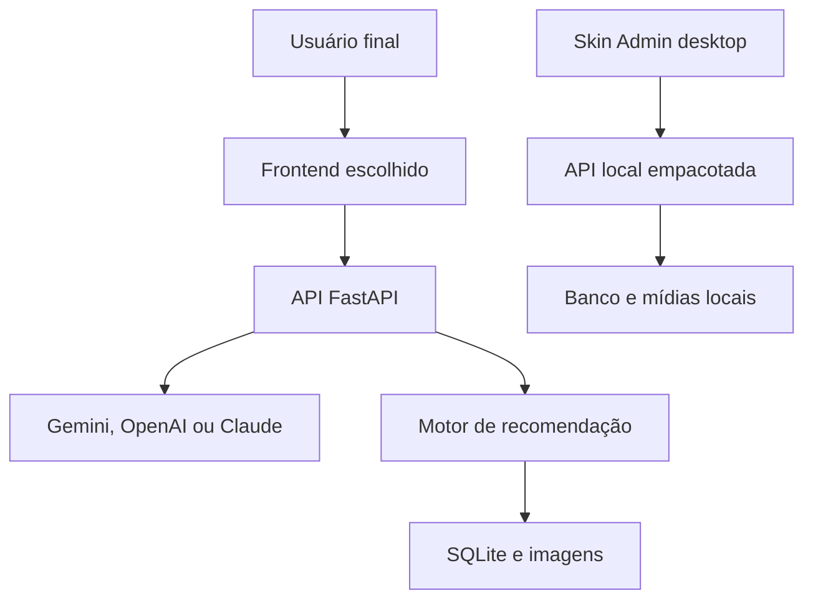
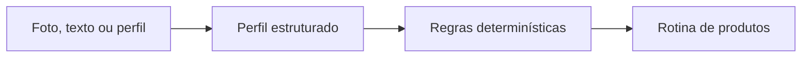

<p align="center">
  
</p>

<h1 align="center">API de Análise de Pele — Versão X</h1>

<p align="center">
  API reutilizável para análise cosmética de pele, recomendação determinística de produtos e gerenciamento de catálogo, acompanhada de uma demonstração web e de um painel instalável para Windows.
</p>

<p align="center">
  <strong>FastAPI</strong> · <strong>React</strong> · <strong>TypeScript</strong> · <strong>SQLite</strong> · <strong>Tauri</strong> · <strong>Gemini</strong> · <strong>OpenAI</strong> · <strong>Claude</strong>
</p>

> [!IMPORTANT]
> A análise é informativa e cosmética. O sistema não realiza diagnóstico médico, não substitui avaliação dermatológica e pode apresentar resultados diferentes conforme fotografia, descrição, modelo de IA e condições de uso.

## Estado final do projeto

| Item | Estado |
|---|---|
| API FastAPI | Concluída e testada |
| Frontend público Lumina | Concluído e responsivo |
| Painel administrativo | Concluído para uso local |
| Aplicativo Windows | Configurado com Tauri 2 e API empacotada |
| Inteligência artificial | Gemini, OpenAI e Anthropic Claude |
| Catálogo em lote | CSV, XLSX ou texto organizado por IA |
| Histórico demonstrativo | Consentimento, exclusão e retenção máxima de 365 dias |
| Testes automatizados | 62 testes aprovados |
| Documentação e tutoriais | Concluídos |

O escopo da **Versão X** está encerrado. Isso significa que a edição planejada foi implementada e validada; não significa que o projeto esteja pronto para operação comercial sem adaptações de segurança, infraestrutura, privacidade e regras de negócio.

### Demonstração pública preservada

- **Site Lumina v3.9:** [https://lumina-skin-lyart.vercel.app](https://lumina-skin-lyart.vercel.app)
- **API publicada:** [https://api-production-f6fd.up.railway.app](https://api-production-f6fd.up.railway.app)
- **Documentação Swagger:** [https://api-production-f6fd.up.railway.app/docs](https://api-production-f6fd.up.railway.app/docs)
- **Código preservado da v3.9.0:** [tag v3.9.0](https://github.com/GabrielJalmeida/api-analise-pele/tree/v3.9.0)

A publicação acima é uma demonstração acadêmica e de portfólio. A Versão X também pode ser instalada e usada localmente, com banco e catálogo próprios.

## O que realmente é este projeto

O produto central é a **API de Análise de Pele**. Ela pode ser consumida por qualquer frontend compatível com HTTP e JSON.

**Lumina Skin** é a marca fictícia criada para demonstrar a experiência completa. O frontend Lumina não é obrigatório e não limita a API. Uma empresa pode criar seu próprio site, identidade visual, catálogo, hospedagem e regras comerciais.

O repositório reúne quatro partes:

| Componente | Finalidade |
|---|---|
| **API FastAPI** | Analisa foto ou texto, valida perfis, gerencia produtos, calcula recomendações e registra seleções demonstrativas. |
| **Frontend Lumina Skin** | Demonstra como uma pessoa pode realizar a análise e receber uma rotina personalizada. |
| **Skin Admin** | Administra produtos, imagens, importações, pedidos demonstrativos e configuração de IA. |
| **Aplicativo Windows** | Empacota o painel e uma API local em um instalador, sem exigir terminal ou navegador do usuário final. |

## Tutoriais visuais

O projeto possui três tutoriais completos em HTML, CSS e JavaScript. Eles funcionam offline, são responsivos e incluem ilustrações, comandos copiáveis, checklists, impressão em PDF e solução de erros comuns.

### [Baixar o pacote com os três tutoriais](docs/Tutoriais-API-Analise-de-Pele)

Depois de baixar:

1. extraia todo o arquivo ZIP;
2. dê dois cliques em `LEIA-ME.html`;
3. escolha o tutorial desejado.

| Tutorial | Conteúdo |
|---|---|
| **1 — Como usar a Lumina v3.9** | Instalação pelo VS Code, ambiente virtual, banco, Uvicorn, frontend, painel e testes completos. |
| **2 — Como integrar a API** | Conceitos para iniciantes, API local ou hospedada, chaves, CORS e exemplo funcional em HTML/CSS/JS. |
| **3 — Como usar a Versão X** | Instalação do painel Windows, primeiro uso, IA, catálogo, importação, histórico e backup local. |

O segundo tutorial inclui um pequeno frontend independente e adaptável. Nenhuma chave de IA está presente nos arquivos do navegador.

## Arquitetura



Na demonstração publicada, frontend e API ficam hospedados. No aplicativo Windows, o painel inicia uma API local em `127.0.0.1:8765` e administra somente os dados daquele computador.

## Fluxos de análise

O usuário pode escolher livremente entre três entradas independentes:

1. **Fotografia**, com descrição complementar opcional;
2. **Descrição em texto**;
3. **Perfil já conhecido**, sem utilizar IA.

A fotografia não é obrigatória. A interface consumidora decide qual opção destacar; o backend valida apenas a rota utilizada.



A inteligência artificial interpreta a entrada, mas **não escolhe os produtos**. A recomendação é executada por regras controladas e testáveis no backend.

### Análise por fotografia

- aceita JPG, PNG e WEBP;
- limita o arquivo a 5 MB e a imagem a 50 megapixels;
- corrige orientação EXIF e remove metadados desnecessários;
- otimiza a imagem no navegador e novamente no backend;
- não armazena a fotografia analisada;
- aceita rosto completo ou região facial útil;
- permite observações locais quando não há cobertura suficiente para estimar o tipo global;
- pode identificar espinhas, marcas pós-acne, vermelhidão, descamação e brilho excessivo;
- usa texto complementar opcional para características que não podem ser inferidas somente pela imagem.

Se fotografia e texto indicarem tipos de pele diferentes, a API solicita confirmação. A confirmação chama `/recomendacoes` e não envia a fotografia novamente ao provedor.

### Análise por texto

A descrição pode informar:

- comportamento da pele ao longo do dia;
- oleosidade ou ressecamento;
- sensibilidade;
- presença de espinhas.

O fluxo distingue:

- análise concluída;
- informações insuficientes;
- conteúdo fora do domínio;
- tentativa de instrução adversarial.

### Perfil direto

Quando a pessoa já sabe o tipo da pele, o frontend pode enviar diretamente:

```json
{
  "tipo_pele": "oleosa",
  "sensivel": true,
  "tem_espinha": true
}
```

Esse caminho não chama nenhum provedor de IA.

## Provedores de inteligência artificial

A Versão X possui uma interface comum para três provedores:

| `AI_PROVIDER` | Chave utilizada | Modelo configurável |
|---|---|---|
| `gemini` | `GEMINI_API_KEY` | `GEMINI_MODEL` |
| `openai` | `OPENAI_API_KEY` | `OPENAI_MODEL` |
| `anthropic` ou `claude` | `ANTHROPIC_API_KEY` | `ANTHROPIC_MODEL` |

Somente a chave do provedor ativo é necessária. Não existe troca automática entre provedores, evitando custos ou envio de dados para outra conta sem decisão explícita.

Sem chave de IA, continuam funcionando:

- status da API;
- catálogo e consulta de produtos;
- perfil direto;
- recomendações determinísticas;
- cadastro e importação por planilha no ambiente local.

Análise por texto, análise por fotografia e importação de texto desestruturado exigem um provedor configurado.

## Recomendação determinística

Um produto só participa da recomendação quando:

- está ativo;
- possui estoque maior que zero;
- corresponde ao tipo de pele informado ou é indicado para todos os tipos.

| Regra | Pontuação interna |
|---|---:|
| Tipo de pele exato | +3 |
| Produto para todos os tipos | +1 |
| Compatível com pele sensível | +2 |
| Indicado para espinhas | +2 |

A pontuação ordena os resultados, mas nunca é apresentada como porcentagem de compatibilidade. O frontend mostra os motivos reais da seleção em linguagem cosmética e não diagnóstica.

## Catálogo de produtos

Somente quatro campos são essenciais:

- nome;
- preço;
- categoria;
- tipo de pele.

São opcionais:

- marca;
- descrição curta;
- imagem;
- conteúdo ou volume;
- ativos principais.

O frontend informa ausências com mensagens neutras, como “Marca não informada”, sem criar composição, benefícios ou dados que não existem.

O estoque inicial é `0`. Nesse estado, o produto permanece cadastrado, mas não participa das recomendações.

Categorias disponíveis:

- `limpeza`;
- `serum`;
- `hidratante`;
- `protetor_solar`;
- `outros`.

### Imagens de produtos

O backend:

- aceita JPG, PNG e WEBP;
- valida arquivos de até 10 MB e 40 megapixels;
- corrige orientação EXIF;
- limita a maior dimensão a 1600 pixels;
- converte para WebP;
- cria nome seguro com identificador único;
- publica em `/media/produtos/{categoria}/...`;
- remove a imagem nova quando o cadastro correspondente falha.

## Importação rápida

O Skin Admin possui dois métodos de importação:

| Método | Limite | Indicado para |
|---|---:|---|
| CSV ou XLSX | 1.000 produtos e 5 MB | Catálogos já organizados |
| Texto + IA | 100 produtos por lote | Dados copiados ou desestruturados |

Os dois fluxos geram uma prévia e exigem confirmação humana. A IA organiza apenas informações presentes; ela não deve inventar preço, estoque, marca, descrição ou ativos.

Um modelo de planilha está disponível em [`docs/modelo-catalogo.csv`](docs/modelo-catalogo.csv). Consulte também o [guia completo de importação](docs/IMPORTACAO_CATALOGO.md).

## Rotina e histórico demonstrativo

O frontend apresenta uma **rotina de cuidados**, organizada por etapas:

1. limpeza;
2. tratamento ou sérum;
3. hidratação;
4. proteção;
5. outros cuidados, quando aplicável.

O produto mais compatível de cada categoria recebe destaque, enquanto as alternativas permanecem disponíveis. O conjunto escolhido pelo usuário forma a sua rotina.

O registro dessa rotina é apenas uma demonstração de integração:

- não há pagamento, checkout ou dados de cartão;
- nome, e-mail e itens são salvos somente após consentimento;
- o backend consulta novamente os preços;
- o identificador do navegador é armazenado somente como hash SHA-256;
- os itens preservam nome, marca, imagem e preço do momento da seleção;
- o usuário pode apagar todo o próprio histórico;
- registros expiram automaticamente;
- a retenção máxima é de 365 dias;
- o estoque não é reduzido por padrão.

E-commerce real, autenticação, cobrança, frete, nota fiscal e segurança financeira devem ser implementados em módulos próprios.

## Instalação local para desenvolvimento

### Pré-requisitos

- Windows 10 ou 11;
- Python 3.12 recomendado;
- Node.js LTS;
- Git e VS Code recomendados.

### 1. Clone o projeto

```cmd
git clone https://github.com/GabrielJalmeida/api-analise-pele.git
cd api-analise-pele
```

### 2. Backend

```cmd
python -m venv .venv
.venv\Scripts\activate
python -m pip install -r requirements-dev.txt
copy .env.example .env
python criar_banco.py
uvicorn main:app --reload
```

Endereços locais:

- API: [http://127.0.0.1:8000](http://127.0.0.1:8000)
- Swagger: [http://127.0.0.1:8000/docs](http://127.0.0.1:8000/docs)

O banco começa vazio. Para carregar exclusivamente o catálogo fictício da demonstração:

```cmd
python popular_catalogo.py --aplicar
```

### 3. Frontend público

Em outro terminal:

```cmd
cd frontend
npm install
copy .env.example .env
npm run dev
```

Configuração esperada:

```env
VITE_API_URL=http://127.0.0.1:8000
```

### 4. Painel no navegador

Em outro terminal, a partir da raiz:

```cmd
cd admin
npm install
copy .env.example .env
npm run dev
```

Se site e painel forem iniciados juntos, o Vite normalmente usa as portas `5173` e `5174`. Use sempre o endereço exibido no terminal.

## Aplicativo Windows

O aplicativo usa Tauri 2. O Skin Admin abre em uma janela própria e inicia silenciosamente uma API FastAPI empacotada com PyInstaller.

Depois de instalado, o usuário final não precisa abrir terminal, navegador, Python ou Node.js.

### Dados de cada instalação

No primeiro uso, o aplicativo cria:

```text
%LOCALAPPDATA%\com.gabrielalmeida.skinadmin\
├── config\.env
├── data\produtos.db
├── media\produtos\
└── lumina-api.log
```

O banco começa vazio. Cada instalação administra somente seus próprios dados e não modifica a demonstração pública.

### Gerar o instalador no Windows

O código-fonte não depende de uma chave de IA para ser compilado. Em um computador Windows com Python, Node.js, Rust/Cargo, Microsoft C++ Build Tools e WebView2:

```cmd
build_windows.bat
```

Saídas esperadas:

```text
dist\lumina-api.exe
admin\src-tauri\target\release\bundle\nsis\*-setup.exe
```

Também existe o workflow manual **Build Skin Admin para Windows** em `.github/workflows/build-desktop-windows.yml`.

> [!NOTE]
> O instalador não possui certificado comercial de assinatura. O Windows SmartScreen pode exibir um aviso. Distribuições comerciais devem assinar o executável.

Consulte o [guia detalhado do aplicativo desktop](docs/GUIA_DESKTOP.md).

## Configuração do backend

Exemplo completo:

```env
AI_PROVIDER=gemini

GEMINI_API_KEY=
OPENAI_API_KEY=
ANTHROPIC_API_KEY=

GEMINI_MODEL=gemini-3.5-flash-lite
OPENAI_MODEL=gpt-5.6-luna
ANTHROPIC_MODEL=claude-haiku-4-5-20251001

APP_ENV=development
DATABASE_PATH=
LUMINA_DATA_DIR=
MEDIA_PATH=
PEDIDOS_ATUALIZAM_ESTOQUE=false
CORS_ORIGINS=http://localhost:5173,http://localhost:5174
```

Nunca envie chaves reais ao GitHub, frontend ou arquivos de exemplo.

### Ambientes

| `APP_ENV` | Comportamento |
|---|---|
| `development` | Desenvolvimento local completo |
| `desktop` | Aplicativo instalado com administração local habilitada |
| `production` | Demonstração pública; rotas administrativas são ocultadas |

## Rotas principais

### Gerais e catálogo

| Método | Rota | Finalidade |
|---|---|---|
| GET | `/` | Confirma funcionamento da API |
| GET | `/status` | Retorna estado e versão |
| GET | `/produtos` | Lista e filtra o catálogo |
| GET | `/produto/{id_produto}` | Consulta um produto |
| POST | `/produto` | Cadastra produto no ambiente administrativo |
| PATCH | `/produto/{id_produto}` | Atualiza produto |
| DELETE | `/produto/{id_produto}` | Desativa produto por soft delete |
| POST | `/produtos/imagem` | Processa imagem de produto |
| DELETE | `/produtos/imagem` | Remove imagem administrativa permitida |

### Análise e recomendação

| Método | Rota | Finalidade |
|---|---|---|
| POST | `/perfil-pele` | Valida perfil informado diretamente |
| POST | `/analise-texto` | Interpreta descrição com IA |
| POST | `/analise-foto` | Interpreta fotografia e texto opcional |
| POST | `/recomendacoes` | Recomenda produtos para perfil conhecido |

### Importação, histórico e configuração

| Método | Rota | Finalidade |
|---|---|---|
| POST | `/produtos/importacao/arquivo` | Gera prévia de CSV/XLSX |
| POST | `/produtos/importacao/ia` | Organiza texto e gera prévia |
| POST | `/produtos/importacao/confirmar` | Confirma lote revisado |
| POST | `/pedidos` | Registra seleção demonstrativa |
| GET | `/pedidos/historico` | Consulta histórico do navegador |
| DELETE | `/pedidos/historico` | Apaga histórico do navegador |
| GET | `/admin/pedidos` | Consulta local no painel |
| GET | `/admin/configuracao/ia` | Consulta configuração local sem devolver a chave |
| PUT | `/admin/configuracao/ia` | Atualiza provedor, modelo e chave locais |

As rotas administrativas respondem `404` quando `APP_ENV=production`.

## Exemplo mínimo de integração

```html
<button id="analisar">Analisar perfil</button>
<p id="resultado"></p>

<script>
  const API_URL = "http://127.0.0.1:8000";

  document.querySelector("#analisar").addEventListener("click", async () => {
    const resposta = await fetch(`${API_URL}/recomendacoes`, {
      method: "POST",
      headers: { "Content-Type": "application/json" },
      body: JSON.stringify({
        tipo_pele: "oleosa",
        sensivel: true,
        tem_espinha: true
      })
    });

    const dados = await resposta.json();

    document.querySelector("#resultado").textContent =
      `${dados.total_recomendacoes} produtos encontrados`;
  });
</script>
```

O [Tutorial 2](docs/Tutoriais-API-Analise-de-Pele.zip) contém uma integração maior e funcional com perfil, texto, fotografia, carregamento, erros e apresentação de produtos.

## Testes e validação

### Backend

```cmd
python -m pytest -q
python -m compileall -q .
```

Resultado final: **62 testes aprovados**.

### Frontend público

```cmd
cd frontend
npm ci
npm run lint
npm run build
```

### Painel

```cmd
cd admin
npm ci
npm run lint
npm run build
npm run build:desktop
```

Na validação final:

- módulos Python compilados;
- 62 testes aprovados;
- lint do frontend aprovado;
- build do frontend aprovado;
- lint do painel aprovado;
- builds web e desktop do painel aprovados;
- API empacotada iniciada com banco vazio e integridade SQLite confirmada;
- configuração Tauri, sidecar e workflow Windows revisados.

O relatório reproduzível está em [`docs/RELATORIO_VALIDACAO.md`](docs/RELATORIO_VALIDACAO.md).

## Deploy de uma instância própria

A hospedagem da Lumina é apenas demonstração. Para usar a API em outro projeto:

1. hospede o backend em um serviço compatível com FastAPI;
2. configure um volume persistente para SQLite e imagens;
3. coloque a chave de IA somente nas variáveis do servidor;
4. defina `APP_ENV=production`;
5. informe em `CORS_ORIGINS` somente os domínios autorizados;
6. aponte `VITE_API_URL` do frontend para o endereço HTTPS da API;
7. não publique o painel administrativo sem autenticação e autorização.

Para tráfego, catálogo ou equipe maiores, considere substituir:

- SQLite por PostgreSQL ou outro banco de servidor;
- arquivos locais por armazenamento de objetos;
- administração local por painel autenticado com controle de permissões.

A interface HTTP permite essa evolução sem obrigar o uso do frontend Lumina.

## Privacidade, segurança e limites

- fotografias de análise são processadas em memória e não são armazenadas pela aplicação;
- a fotografia é enviada ao provedor de IA escolhido;
- resultados de IA são probabilísticos;
- o histórico demonstrativo contém dados pessoais e exige consentimento;
- retenção automática não substitui política de privacidade adequada ao país e ao negócio;
- chaves de IA pertencem exclusivamente ao backend;
- o painel web não deve ser publicado sem autenticação;
- não existem pagamentos, prontuário médico ou segurança financeira;
- a API deve receber monitoramento, backups e infraestrutura adequados antes de uso comercial.

Leia [Privacidade e Limites](docs/PRIVACIDADE_E_LIMITES.md) e [Decisões de Arquitetura](docs/DECISOES_ARQUITETURA.md).

## Estrutura do repositório

```text
api-analise-pele/
├── admin/                         # painel React e aplicativo Tauri
│   └── src-tauri/                 # instalador e sidecar Windows
├── frontend/                      # demonstração pública Lumina
├── media/produtos/                # acervo fictício opcional
├── routers/                       # rotas FastAPI
├── tests/                         # suíte automatizada
├── docs/                          # guias, relatório e tutoriais
├── .github/workflows/             # build manual do aplicativo Windows
├── ai_providers.py                # Gemini, OpenAI e Claude
├── ai_service.py                  # contratos e prompts de análise
├── catalog_import_service.py      # CSV e XLSX
├── catalog_ai_service.py          # organização de texto com IA
├── order_service.py               # histórico e retenção
├── product_image_service.py       # processamento de imagens
├── desktop_api.py                 # entrada da API empacotada
├── desktop_api.spec               # configuração PyInstaller
├── build_windows.bat              # build completo do instalador
├── main.py                        # aplicação FastAPI
└── README.md
```

## Documentação complementar

- [Guia do aplicativo desktop](docs/GUIA_DESKTOP.md)
- [Importação de catálogo](docs/IMPORTACAO_CATALOGO.md)
- [Privacidade e limites](docs/PRIVACIDADE_E_LIMITES.md)
- [Decisões de arquitetura](docs/DECISOES_ARQUITETURA.md)
- [Relatório de validação](docs/RELATORIO_VALIDACAO.md)
- [Histórico de mudanças](CHANGELOG.md)
- [Pacote de tutoriais visuais](docs/Tutoriais-API-Analise-de-Pele.zip)

## Histórico de versões

- **V1:** API e regras iniciais de recomendação;
- **V2:** integração com IA, testes e estabilização do backend;
- **V3:** frontend público, painel, catálogo visual e deploy;
- **v3.9.0:** marco final preservado da demonstração Lumina;
- **Versão X:** edição especial consolidada com IA multiprovedor, rotina personalizada, histórico demonstrativo, importação em lote e aplicativo Windows.

## Escopo final

Este repositório entrega uma base completa para demonstrar e reutilizar:

- integração entre frontend e API;
- inteligência artificial com saída estruturada;
- visão computacional aplicada a um fluxo cosmético;
- recomendação por regras de negócio;
- catálogo e imagens administráveis;
- importação em lote;
- persistência e retenção de histórico;
- aplicação desktop com backend local;
- testes automatizados e documentação de entrega.

Quem reutilizar o projeto pode manter somente a API, trocar a interface, alterar o catálogo, escolher outro provedor, hospedar em outra infraestrutura e implementar os módulos comerciais necessários.

---

Desenvolvido por **Gabriel Almeida** como projeto acadêmico e de portfólio.

Repositório: [github.com/GabrielJalmeida/api-analise-pele](https://github.com/GabrielJalmeida/api-analise-pele)
