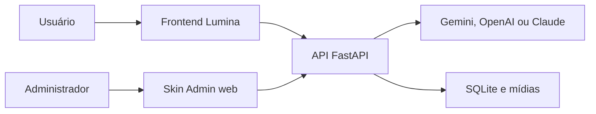

<p align="center">
  
</p>

<h1 align="center">API de Análise de Pele — Versão 4</h1>

<p align="center">
  API FastAPI para análise cosmética, recomendação determinística e catálogo, acompanhada de uma demonstração web e de um painel administrativo no navegador.
</p>

<p align="center">
  <strong>FastAPI</strong> · <strong>React</strong> · <strong>TypeScript</strong> · <strong>SQLite</strong> · <strong>Gemini</strong> · <strong>OpenAI</strong> · <strong>Claude</strong>
</p>

> [!IMPORTANT]
> A análise é informativa e cosmética. O sistema não realiza diagnóstico médico e não substitui avaliação dermatológica.

## Estado da Versão 4

| Componente | Estado |
|---|---|
| API FastAPI | Funcional e coberta por testes |
| Frontend Lumina | Funcional e responsivo |
| Skin Admin | Funcional no navegador, consumindo a API |
| IA | Gemini, OpenAI e Anthropic Claude |
| Catálogo | CRUD, imagens e importação CSV/XLSX/IA |
| Pedidos demonstrativos | Consentimento e retenção máxima de 365 dias |

O Skin Admin é uma aplicação React independente e se comunica por HTTP com a URL configurada em `VITE_API_URL`.

## Arquitetura



O produto central é a API. Os dois frontends são clientes HTTP independentes e podem ser substituídos por outras interfaces.

## Funcionalidades

### API

- análise por fotografia ou descrição;
- validação de perfil informado diretamente, sem IA;
- recomendação determinística de produtos;
- CRUD e filtros de catálogo;
- processamento de imagens de produtos;
- importação com prévia por CSV, XLSX ou texto organizado por IA;
- pedidos demonstrativos, sem pagamento;
- retenção e exclusão do histórico;
- IDs e tempos de requisição para observabilidade.

### Skin Admin

- cadastrar, editar, buscar, ativar e desativar produtos;
- enviar e substituir imagens;
- revisar e confirmar importações em lote;
- consultar pedidos demonstrativos;
- selecionar a API de destino com `VITE_API_URL`.

Credenciais e modelos de IA são configuração do servidor. Eles ficam no `.env` do backend e nunca são enviados ao navegador.

## Requisitos

- Python 3.12 ou mais recente;
- Node.js LTS e npm;
- Git, opcional para clonar o repositório.


## Instalação local

### 1. Backend

No PowerShell, a partir da raiz do projeto:

```powershell
python -m venv .venv
.\.venv\Scripts\Activate.ps1
python -m pip install -r requirements-dev.txt
Copy-Item .env.example .env
python criar_banco.py
uvicorn main:app --reload
```

Endereços:

- API: `http://127.0.0.1:8000`
- Swagger: `http://127.0.0.1:8000/docs`

O banco começa vazio. Para carregar o catálogo fictício:

```powershell
python popular_catalogo.py --aplicar
```

### 2. Frontend público

Em outro terminal:

```powershell
Set-Location frontend
npm install
Copy-Item .env.example .env
npm run dev
```

### 3. Painel administrativo

Com a API em execução, abra outro terminal:

```powershell
Set-Location admin
npm install
Copy-Item .env.example .env
npm run dev
```

O arquivo `admin/.env` deve apontar para a API:

```env
VITE_API_URL=http://127.0.0.1:8000
```

Se os dois frontends estiverem abertos, o Vite pode escolher portas diferentes. Use os endereços mostrados em cada terminal e inclua ambos em `CORS_ORIGINS`.

## Configuração do backend

```env
AI_PROVIDER=gemini

GEMINI_API_KEY=
OPENAI_API_KEY=
ANTHROPIC_API_KEY=

GEMINI_MODEL=gemini-3.5-flash-lite
OPENAI_MODEL=gpt-5.6-luna
ANTHROPIC_MODEL=claude-haiku-4-5-20251001

APP_ENV=development
DATABASE_PATH=
MEDIA_PATH=
PEDIDOS_ATUALIZAM_ESTOQUE=false
CORS_ORIGINS=http://localhost:5173,http://localhost:5174
```

Somente a chave do provedor ativo é obrigatória para análises por foto/texto e importação por IA. Catálogo, perfil direto e recomendações funcionam sem chave.

### Ambientes e segurança administrativa

| `APP_ENV` | Comportamento |
|---|---|
| `development` | Libera as operações administrativas para uso local |
| `production` | Oculta operações administrativas de escrita e consulta de pedidos |

O painel fornecido deve ser usado localmente com uma API de desenvolvimento. Publicá-lo exige autenticação, autorização, auditoria e proteção contra abuso; apenas CORS não protege uma API.

## Rotas principais

| Método | Rota | Finalidade |
|---|---|---|
| GET | `/status` | Saúde e versão da API |
| GET | `/produtos` | Listagem e filtros do catálogo |
| POST | `/produto` | Cadastro administrativo |
| PATCH | `/produto/{id}` | Edição ou reativação |
| DELETE | `/produto/{id}` | Desativação lógica |
| POST/DELETE | `/produtos/imagem` | Gerenciamento de imagens |
| POST | `/produtos/importacao/arquivo` | Prévia CSV/XLSX |
| POST | `/produtos/importacao/ia` | Prévia de texto com IA |
| POST | `/produtos/importacao/confirmar` | Confirmação da importação |
| POST | `/perfil-pele` | Perfil sem IA |
| POST | `/analise-texto` | Análise textual |
| POST | `/analise-foto` | Análise de imagem |
| POST | `/recomendacoes` | Recomendação determinística |
| POST | `/pedidos` | Registro demonstrativo |
| GET/DELETE | `/pedidos/historico` | Histórico do navegador |
| GET | `/admin/pedidos` | Consulta local no painel |

O contrato completo fica disponível em `/docs` enquanto a API estiver rodando.

## Validação

```powershell
.\.venv\Scripts\python.exe -m pytest -q --basetemp .pytest-build-temp
.\.venv\Scripts\python.exe -m compileall -q main.py config.py models.py services.py routers tests

Set-Location frontend
npm run lint
npm run build

Set-Location ..\admin
npm run lint
npm run build
```

O checklist e os resultados da entrega estão em [docs/RELATORIO_VALIDACAO.md](docs/RELATORIO_VALIDACAO.md).

## Deploy

O arquivo `railway.json` inicia a API com Uvicorn. Em uma instância própria:

1. configure as variáveis do backend no provedor;
2. use armazenamento persistente para `DATABASE_PATH` e `MEDIA_PATH`;
3. limite `CORS_ORIGINS` aos domínios esperados;
4. use `APP_ENV=production` para uma API pública;
5. configure `VITE_API_URL` no build de cada frontend.

SQLite e arquivos locais são adequados para demonstração e instância única. Para múltiplas réplicas ou uso comercial, migre para banco de servidor e armazenamento de objetos.

## Estrutura

```text
admin/                 painel React no navegador
frontend/              demonstração Lumina
routers/               rotas FastAPI
tests/                 testes automatizados
docs/                  arquitetura, privacidade e tutoriais
main.py                aplicação FastAPI
models.py              contratos Pydantic
database.py            conexão SQLite
criar_banco.py         criação e migrações do banco
```

## Privacidade

Fotografias de análise são processadas em memória e não são gravadas pelo projeto. Consulte [docs/PRIVACIDADE_E_LIMITES.md](docs/PRIVACIDADE_E_LIMITES.md) antes de adaptar o sistema para uso real.
